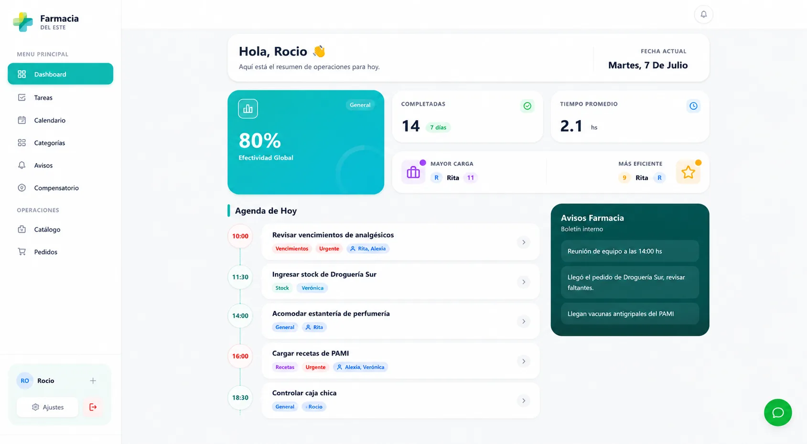
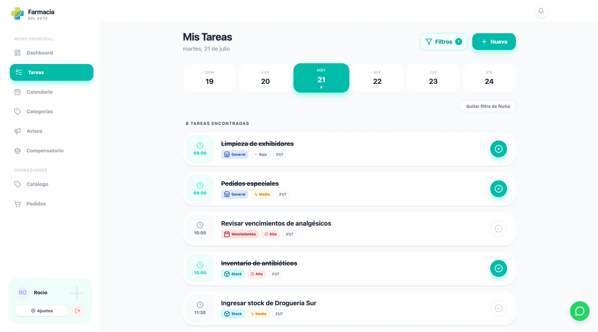

# Farmacia del Este

Aplicación web de gestión interna para organizar tareas, calendario, avisos, productos y pedidos de una farmacia desde una misma interfaz.

**[Ver el caso de estudio](https://jeremiashiltpeletti.com/farmacia-del-este/)**

## Vista previa

| Panel de actividad | Tareas del equipo |
| --- | --- |
|  |  |

Las capturas proceden del caso de estudio publicado en mi portfolio y muestran información de ejemplo.

## El problema

En la jornada de una farmacia coinciden tareas con distintos responsables y horarios, pedidos a proveedores y avisos internos. Cuando la información está repartida entre notas, mensajes y planillas, cuesta saber qué queda pendiente y quién se encarga.

## La solución

Una interfaz para consultar la actividad del equipo y trabajar con módulos específicos. Este repositorio contiene una **versión demostrativa local** que permite recorrer esos flujos con registros de ejemplo.

## Funcionalidades

- Tareas asignadas a integrantes, con prioridades, categorías, horarios, estados, listas de verificación y filtros.
- Calendario con tareas y eventos, avisos internos y recordatorios mientras la aplicación está abierta.
- Panel con resumen de tareas y actividad del equipo.
- Catálogo de productos y pedidos a proveedores con seguimiento de estados por pedido y por producto.
- Validación y búsqueda de códigos de barras en catálogos locales o de referencia; importación de referencias JSON con revisión previa.
- Registro de clientes y días compensatorios, con vistas según el perfil de demostración.

## Tecnologías

React, TypeScript, Vite, Tailwind CSS y React Router para la interfaz. `localForage` conserva los datos de la demo en el navegador y Express puede servir la compilación en Node. El desarrollo se apoyó en Google AI Studio.

## Cómo está organizado

| Ruta | Responsabilidad |
| --- | --- |
| `App.tsx`, `pages/`, `components/` | Navegación, pantallas e interfaz |
| `context.tsx`, `types.ts` | Estado compartido y tipos de datos |
| `mockFirestore.ts`, `constants.ts` | Persistencia local y registros iniciales de ejemplo |
| `modules/barcode/` | Validación, búsqueda e importación de referencias |
| `public/manifest.json`, `service-worker.js` | Metadatos de instalación y service worker |
| `server.js`, `vite.config.ts` | Servicio de archivos compilados y entorno de desarrollo |

## Ejecutar en local

Necesitás Node.js y npm:

```bash
git clone https://github.com/JeremiasHiltPeletti/Farmacia-del-Este.git
cd Farmacia-del-Este
npm ci
npm run dev
```

Abrí la dirección que indique Vite (la configuración usa el puerto 3000). Para generar y revisar una compilación:

```bash
npm run build
npm run preview
```

La pantalla de ingreso indica el PIN de demostración.

## Alcance de esta versión

Los cambios se almacenan en el navegador del dispositivo; borrar los datos del sitio puede eliminarlos. El PIN y los roles se resuelven en el cliente y **no constituyen autenticación segura**. Las notificaciones funcionan en el contexto de la aplicación abierta. Este repositorio es una demostración del producto y su interfaz, no un sistema listo para operar con datos reales de clientes o pacientes.

## Decisiones técnicas

`mockFirestore.ts` implementa una capa local que imita parte de la API de Firestore, mientras que `firebase.ts` contiene funciones de reemplazo. Aunque Firebase figura entre las dependencias, **esta versión no sincroniza datos con Firebase ni entre dispositivos**. Las integraciones externas están desactivadas y no se ejecuta un modelo de IA durante el uso de esta versión.

---

Desarrollado por [Jeremias Hilt Peletti](https://jeremiashiltpeletti.com/).
